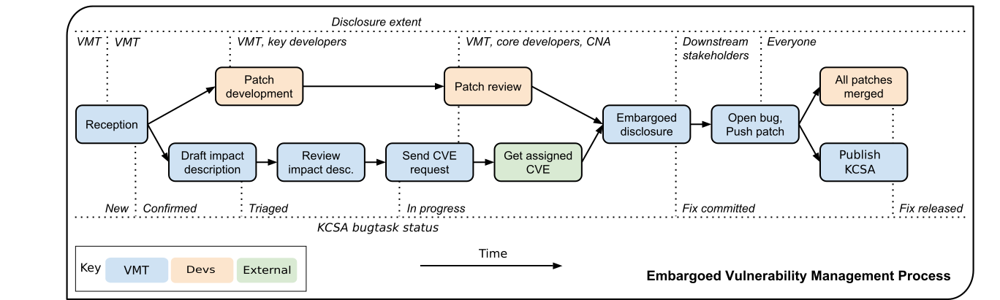

# Vulnerability Management Process

> The Kata Containers vulnerability management policy is derived from the [OpenStack Vulnerability Management Process](https://security.openstack.org/vmt-process.html) and licensed under the [Creative Commons Attribution 3.0 Unported License](https://creativecommons.org/licenses/by/3.0/legalcode)

The Kata Containers Vulnerability Management Team (VMT) is responsible for coordinating the progressive disclosure of a vulnerability.

Members of the team are independent and security-minded folks who ensure that vulnerabilities are dealt with in a timely manner and that downstream stakeholders are notified in a coordinated and fair manner.
Where a member of the team is employed by a downstream stakeholder, the member does not give their employer prior notice of any vulnerabilities.
In order to reduce the risk of accidental disclosure of vulnerability in the early stages, membership of this team is intentionally limited to a small number of people.

# Acronyms

To aid reading this document it helps to understand some key acronyms:

| Acronym  | Description                                                     |
| -------- | --------------------------------------------------------------- |
| CNA      | [CVE Numbering Authority](https://cve.mitre.org/cve/cna.html)   | 
| CVE      | [Common Vulnerabilities and Exposures](https://en.wikipedia.org/wiki/Common_Vulnerabilities_and_Exposures) |
| KCSA     | Kata Containers Security Advisory                               |
| KCSN     | Kata Containers Security Note                                   |
| PR       | [A GitHub Pull Request](https://help.github.com/articles/about-pull-requests/) |
| VMT      | The Kata Containers Vulnerability Management Team               |

# Supported versions

The VMT coordinates patches fixing vulnerabilities in
[supported stable branches of Kata Containers](https://github.com/kata-containers/documentation/blob/master/Stable-Branch-Strategy.md#branch-management),
in addition to the master branch (next version under development).

# Process

Each security bug is assigned a VMT *coordinator* (a member from the VMT) that will drive the fixing and disclosure process.
Here are the steps followed.

## Reception

A report is received via the [Kata Containers Launchpad](https://launchpad.net/katacontainers.io). New reports should be created as a "Private Bug", thus initially restricting visibility
to the VMT members and the reporter.

The first steps performed by the VMT are:

* Confirm the validity of the report.
* Prefix the description with an [embargo reminder](templates/reception-embargo-reminder.md).
* Create and fill out a Kata Containers Security Advisory ([KCSA](templates/KCSA.md)) document, and attach it to the report.
* If the KCSA or report are *Incomplete*, add an [incomplete reception message](templates/reception-incomplete-message.md) in a comment.
* Once the VMT confirms a KCSA is warranted, the KCSA Issue status will be set to *Confirmed*.
* If the need for a KCSA is challenged, the KCSA Issue status should be set back to *Incomplete* until that question is resolved.

For some lower-risk issues or problems which may only be easy to solve in future releases, the KCSA Issue will be set to *Opinion* and the core security reviewers for Kata Containers will be subscribed to determine whether they wish to issue a Kata Containers Security Note (KCSN) (these reports may still sometimes remain under embargo until the KCSN is issued).
If no KCSA is warranted and there is no benefit to a KCSN then the KCSA Issue will be set to *Won't Fix* or *Invalid* (depending on the specific situation) and the bug state switched from *Private Security* to *Public*, optionally adding the *security* bug tag if the report concerns a potential security hardening opportunity.

If a Kata Containers Security Note (KCSN) is warranted, one should be written and posted to the [Kata Containers Security Note](templates/KCSN.md) document.

The specifics are indexed in the [report taxonomy](#incident-report-taxonomy) and [task status](#kcsa-task-status) tables.

## Patch development

For a private report, the reporter and the affected project's core security review teams, plus anyone they deem necessary to develop and validate a fix, are added to the Launchpad bug subscription list.
A fix is proposed as a patch to the current master branch (as well as any affected supported branches) and attached to the Launchpad bug, **not sent to the public code review system**.

For public reports, there is no need to directly subscribe anyone and patches can be submitted directly to the code review system instead as Pull Requests (PR).

If project-side delays are encountered at this or any subsequent stage of the process, the VMT and other interested parties may reach out to all or any of the following [OpenStack Foundation](https://www.openstack.org/foundation/) members:

- @ttx
- @fungi

## Patch review

For a private report, once the initial patch has been attached to the bug, core reviewers on the subscription list from the project in question should review it and suggest updates or pre-approve it for merging.
Privately-developed patches need to be pre-approved so that they can be fast-tracked through public code review later at disclosure time.

For public reports, Kata Containers usual public code review and approval processes apply.

## Draft impact description

In the mean time, the VMT coordinator prepares a vulnerability description that will be communicated to downstream stakeholders, and will serve as the basis for the Security Advisory (KCSA) that will be finally published.

The description should properly credit the reporter, specify affected versions (including unsupported ones) and accurately describe impact and mitigation mechanisms.
The VMT coordinator should use the [Downstream stakeholder notification](templates/downstream-stakeholder-notification.md) template.
Once the description is posted, the KCSA Issue status should be switched to *Triaged*.

## Review impact description

The description is validated by the reporter and the [Architecture Committee](https://github.com/kata-containers/community#architecture-committee).

### Send CVE request

To ensure full traceability, obtaining a CVE assignment is attempted before the issue is communicated to a larger public.
This is generally done as the patch gets nearer to final approval.

The KCSA Issue status is set to *In progress* and the approved impact description is submitted through [MITRE's CVE Request form](https://cveform.mitre.org/).
The *request type* is `Request a CVE ID`, the *e-mail address* should be that of the requester (generally the assigned VMT coordinator in the case of reports officially managed by the VMT), and for embargoed reports the coordinator's OpenPGP key should be pasted into the field provided.

In the *required* section set the checkboxes indicating the product is not [CVE Numbering Authority](https://cve.mitre.org/cve/cna.html) (CNA) covered and that no prior CVE ID has been assigned, select an appropriate *vulnerability type* (using `Other or Unknown` to enter a freeform type if there is nothing relevant on the drop-down), set the *vendor* to `Kata Containers`, and the *product* and *version* fields to match the `$COMPONENTS` and `$AFFECTED_VERSIONS` from the impact description.
In the *optional* section set the radio button for *confirmed/acknowledged* to `Yes`, choose an appropriate *attack type* in the drop-down (often this is `Context-dependent` for our cases), check the relevant *impact* checkboxes, attempt to fill in the *affected components* and *attack vector* fields if possible, paste in the *suggested description* from the prose of the impact description (usually omitting the first sentence as it's redundant with other fields), put the `$CREDIT` details in the *discoverer/credits* field, and the Issue URL (along with the public Issue and PR URLs for patches if already public) in the *references* field.
If the report is still private, note that in the *additional information* field like `This report is currently under embargo and no disclosure date has been scheduled at this time.`

At the bottom of the page, fill in the *security code* and click the *submit request* button.
If some fields contain invalid data they will be highlighted red; correct these, update the *security code* and *submit request* again until you get a confirmation page.

## Get assigned CVE

MITRE returns the assigned CVE.
It is added to the Launchpad bug in the comment field, and the Issue is retitled to "$TITLE ($CVE)".

## Embargoed disclosure

Once the patches are approved and the CVE is assigned, a signed email with the vulnerability description is sent to the downstream stakeholders.
The disclosure date is set to 3-5 business days, excluding Monday/Friday and holiday periods, at 0000 UTC.
No stakeholder is supposed to deploy public patches before disclosure date.

Once the email is sent, the KCSA Issue status should be set to *Fix committed*.
At that point we can also add downstream stakeholders to the Launchpad bug, if they have an appropriate Launchpad account.

For non-embargoed, public vulnerabilities no separate downstream advance notification is sent.
Instead, the KCSA Issue is set to *Fix committed* status once the CVE assignment is received and KCSA drafting begins immediately.

## Open bug, Push patch

In preparation for this, make sure you have a core developer and a stable maintainer available to help pushing the fix at disclosure time.

On the disclosure hour, open bug, push patches to GitHub PR for review on master and supported stable branches, fast-track approvals (referencing the bug).

Embargo reminder can be removed at that point.

[MITRE's CVE Request form](https://cveform.mitre.org/) should be used again at this point, but instead select a *request type* of `Notify CVE about a publication` and fill in the coordinator's *e-mail address*, provide a *link to the advisory* (Use the links from the [Kata Containers Security Advisories page](KCSA.md) if this is a formal KCSA), the *CVE IDs* covered, and the *date published*.
Once more, fill in the *security code* at the bottom of the page and *submit request*.

## Publish KCSA

Shortly after pushing the patches (potentially waiting for the first test runs to complete), publish the advisory to the [Kata Containers development mailing list](mailto:kata-dev@lists.katacontainers.io) and slack channels, and add the issue to the [list of KCSA's](KCSA.md).
Wait until all patches are merged to supported branches before setting the KCSA Issue status to *Fix released*.

## All patches merged

Patches approved in code review do not necessarily merge immediately, but should be tracked closely until they do.
Subsequent security point releases of affected software may then be tagged if warranted.

# Incident Report Taxonomy

The VMT is now using this classification list in order to assist vulnerability report triage, especially whenever a bug does not warrant an advisory.

| Classes  | Outcome   | Description                               |
| -------- | --------- | ----------------------------------------- |
| Class A  | KCSA      | A vulnerability to be fixed in master and  all supported releases |
| Class B1 | KCSN      | A vulnerability that can only be fixed in master, security note for stable branches, e.g., default config value is insecure
| Class B2 | KCSN      | A vulnerability without a complete fix yet, security note for all versions, e.g., poor architecture / design
| Class B3 | KCSN      | A vulnerability in experimental or debugging features not intended for production use
| Class C1 | Potential | Not considered a practical vulnerability | (but some people might assign a CVE for it), e.g. one depending on UUID guessing
| Class C2 | Potential | A vulnerability, but not in Kata Containers supported code, e.g., in a dependency
| Class D  | Potential | Not a vulnerability, just a bug with (some) security implications, e.g., strengthening opportunities
| Class E  |           | Neither a vulnerability nor hardening opportunity
| Class Y  |           | Vulnerability only found in development release
| Class Z  |           | When due process fails                    |

# KCSA Task status

Here is a summary of the different KCSA task status meanings. These statuses
are set in the Launchpad bug or GitHub Issues using Labels:

| Status        | Meaning                                          |
| ------------- | ------------------------------------------------ |
| Incomplete    | It is still unclear whenever the bug warrants an advisory
| Confirmed     | The vulnerability is confirmed, impact description is in progress
| Triaged       | Impact description has been submitted for review |
| In Progress   | CVE has been requested                           |
| Fix committed | Pre-KCSA has been communicated                   |
| Fix released  | All patches have been merged                     |
| Opinion       | Issue is likely a Class B/C/D, waiting for KCSN  |
| Won't Fix     | Doesn't fit with the project plans, sorry        |
| Invalid       | Class E and Z, not a bug or vulnerability. No further action to be taken

# Extent of Disclosure

The science of vulnerability management is somewhere around being able to assess impact and severity of a report, being able to design security patches, being an obsessive process-following perfectionist and respecting the rule of lesser disclosure.

Lesser disclosure is about disclosing the vulnerability details to an increasing number of people over time, but only to the people that are necessary to reach the next step.
The diagram above shows "disclosure extent" across the various steps of the process.

Vulnerability reporters retain final control over the disclosure of their findings.
If for some reason they are uncomfortable with our process, their choice of disclosure terms prevails.

## Embargo exceptions

To keep the embargo period short and effective, the VMT may choose to open GitHub Issues.
Issues that take too much time to be fixed (e.g., more than 2 weeks) or Issues that require a complex patch are usually better solved in the open.

Whenever such a case occurs, the Kata Containers [Architecture Committee](https://github.com/kata-containers/community#architecture-committee) is subscribed to the Launchpad bug in order to discuss whether or not it's imperative to keep that particular bug private.

The same process is followed if an embargoed issue is, accidentally or not, leaked to the public. In all likelihood that Issue will then be moved to the Public state.

## Downstream stakeholders

Kata Containers as an upstream project is used in a number of distributions, products, private and public service offerings that are negatively affected by vulnerabilities.
In the spirit of [responsible disclosure](https://en.wikipedia.org/wiki/Responsible_disclosure), this ecosystem, collectively known as the downstream stakeholders, needs to be warned in advance to be able to prepare patches and roll them out in a coordinated fashion on disclosure day.
The embargo period is kept voluntarily small (3-5 business days), as a middle ground between keeping the vulnerability under cover for too long and not giving a chance to downstream stakeholders to react.

If you are currently not a referenced stakeholder and think you should definitely be included on that email distribution list, please submit a [Launchpad bug](https://launchpad.net/katacontainers.io) with a rationale for your addition.

# Templates

A number of templates are provided for, and recommended for use in, the workflow for processing vulnerabilities. Those templates are referenced below.

| Template                                                        |
| --------------------------------------------------------------- |
| [Reception incomplete message (unconfirmed issues)](templates/reception-incomplete-message.md) |
| [Reception embargo reminder (private issues)](templates/reception-embargo-reminder.md) |
| [Impact description ($DESCRIPTION)](templates/impact-description.md) |
| [CVE request email (private issues)](templates/cve-request-email-private.md) |
| [CVE request email (public issues)](templates/cve-request-email-public.md) |
| [Downstream stakeholders notification email (private issues)](templates/downstream-stakeholder-notification.md) |
| [Kata Containers security advisories (KCSA)](templates/KCSA.md) |
| [Kata Containers security notes (KCSN)](templates/KCSN.md) |
