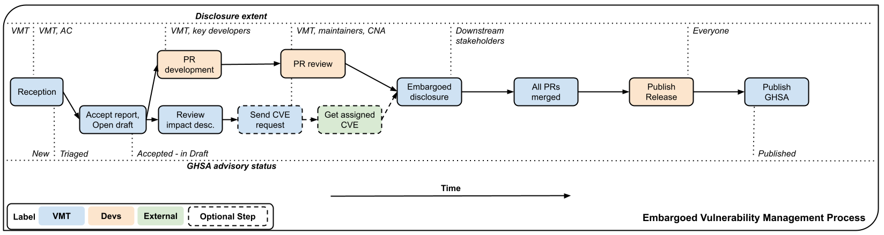

# Vulnerability Management Process

This document describes the vulnerability management process for Kata Containers.
In order to keep the overhead for Kata maintainers as low as possible, the process is designed around [Github security advisories](https://docs.github.com/en/code-security/security-advisories/working-with-repository-security-advisories/about-repository-security-advisories).

The process described here applies to _embargoed vulnerabilities_ that have not been made public yet (full disclosure).
Public reports don't require an embargoed lifecycle, but some of the lifecycle phases may still apply - in particular [publishing the advisory](#published).

## Lifecycle

Over it's lifetime, a Kata security issue can pass the following stages:

1. Reported
2. Triaged
3. Accepted
4. Resolved
5. Published

Shepherding the report through these stages is the responsibility of the [Kata Vulnerability Management Team (VMT)](VMT.md).
Below graphic shows the high-level flow, with details fleshed out in the subsequent sections.

<!-- 
VMT process diagram by @ildikov, available for edit/copy at
https://docs.google.com/drawings/d/11k8ATdUNXpTsJF4HIxTF-T1kSRRdUIA9SOYDNBlmSCc/edit?usp=sharing
-->

## Reported

There are several ways in which a security issue can be reported to the VMT.

1. Security researches can report via GHSA, as documented in the [SECURITY.md](https://github.com/kata-containers/kata-containers/blob/main/SECURITY.md).
2. Maintainers sometimes identify issues while working on the project.
   They should also open a GHSA, but may opt to skip the [triage](#triaged) phase.

The VMT monitors incoming reports and assigns a shepherd for each report.
How shepherds are selected is left for the VMT to decide internally.
The shepherd adds a prominent block to the report, following the [template](templates/vmt-report-header.md).  

## Triaged

The VMT shepherd now proceeds to triage the vulnerability, with the following goals:

1. Establish whether the report is correct.
2. Establish the potential impact of the vulnerability.
3. Determine potential collaborators (subject matter experts, reviewers, etc).

If the VMT shepherd identifies the report as incorrect, or not covered by the threat model, they write a response accordingly.
Depending on certainty, they may opt to leave the report open until the reporter had a chance to answer, but if it's invalid it should eventually be closed.

If the shepherd is convinced by the report, or if in doubt, they accept the report and respond with a brief reason for that decision.
The shepherd can now involve other maintainers as appropriate.
In case the maintenance status is unclear or no available maintainers can be found, they escalate the situation to the AC.

It sometimes happens that the same vulnerability is reported by multiple researchers before a fix is released.
This happens a lot with AI-assisted research and long development lead times.
In that case, the shepherd declares one report the canonical one (the first one, unless a later one has substantially more details).
The other ones are closed, with a thank-you note and a reference to the other report.
If the reports are identical and the embargo is not risked, it's fine to add all reporters as collaborators to the canonical report.
Make sure to add credit for the additional finders.

## Accepted

The shepherd and the involved maintainers assign a preliminary CVSS score.
Severity of an issue strongly depends on who is asking: a local privilege escalation in the guest may not be of concern to the cluster owner, and a confidential computing guest may not care about an escalation from guest to host.
Kata publishes security advisories for the impacted groups, so the severity calculation should take their point of view.
This can result in advisories with very different impact scoring similarly, which is intentional and not a problem.

Once CVSS is assigned and the report is clear, the shepherd can hit the `Request a CVE` button.
CVE assignment takes on the order of weeks in 2026, so doing it early in the process is advised.
That being said, nothing in this process should block on CVE assignment, and additional CVE requests can be made if necessary.

Now the shepherd needs to decide, together with collaborators, how to proceed with the fix.
Low severity issues can usually be treated in the open, in a regular PR.
In that case, the fix is treated as a regular PR and the next step is [publish](#published) after the subsequent release.
The PR author should not discuss PoC details in the PR, but may add reviewers to the GHSA for context.

Higher severity requires handling of the fix under embargo conditions.
The shepherd creates a private fork through the GHSA, which is used to develop the fix.
These forks have severe limitations:

- CI can't run on forks.
  This needs to be addressed by thorough manual testing.
- There can only be one pending reviewer at a time.
  After the first approval, additional reviewers can be added.

At the end of this phase, there should be a PR on the private fork that's approved by two maintainers, without outstanding comments.
The VMT shepherd now sends an embargo notification email, see the [template](templates/downstream-stakeholder-notification.md).
The end date of the embargo is usually chosen to coincide with the next planned release, unless the vulnerability is critical enough to justify an immediate fix.

If problems with the suggested fix are found, this phase is restarted and the thread is updated with new embargo dates.

## Resolved

On the exact day and time of the embargo period end, the PR from the private fork is merged into main.
This requires circumventing branch protection, which is acceptable in this case and can be facilitated by an AC member if needed.
Afterwards, the release process is triggered as soon as possible.

## Published

While the release process completes, the shepherd prepares the advisory for publishing.
At this point, it's important to understand another shortcoming of the GHSAs: there is no differentiation between a _report_ and an _advisory_.

Security reports (as described in the [reported](#reported) section) address maintainers.
They describe where the defect is, and sometimes include all details for exploiting said defect.
Some researches describe the circumstances of how they found the bug, their own background, other related observations or a mix of valid and invalid findings.
Reports are also often overly enriched with details to get the point across.

Crucially, the _report_ style is not useful to Kata users!
What they need is related, but different information.
Thus, it's important to rewrite the advisory body and metadata to be helpful for users.

The shepherd can start from the [template](templates/security-advisory.md) and fill in the details.
In the metadata section, the shepherd should ensure:

- Severity is set and calculated correctly.
- Ecosystem reflects actual intended usage.
  Usually, Kata vulnerabilities fall into `Ecosystem: Other/Kata Containers`, unless the vulnerability is in a published package or crate we support.
  In that case, pick `Go/packagename` or `Rust/cratename`.
- Affected versions is populated, usually with `Affected: <= 4.XX.0; Fixed: 4.XY.0`.
- Credit is given to all finders, the remediation developer, the reviewers and the shepherd.

Once the report is tidy and the release finished baking, hit the `publish` button.
GHSAs can be modified later, if need be.
